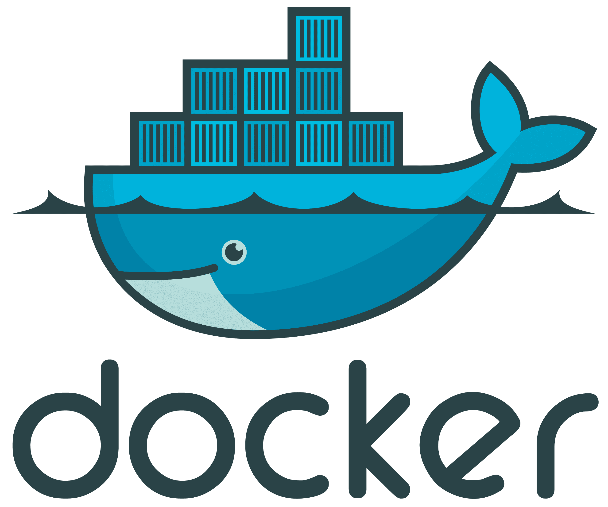
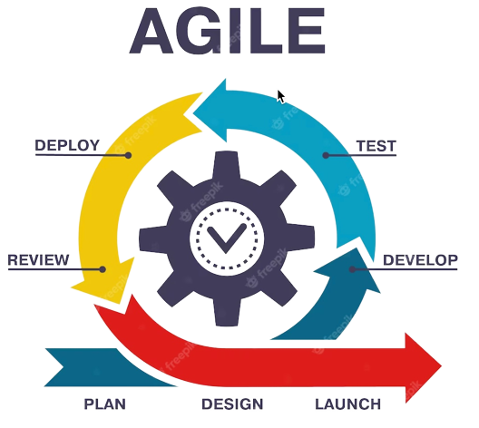

<a href="https://www.github.com/cvir3" target="_blank" rel="noreferrer">

 
</a>

<h1 align="center">Hi 👋🏻, I'm <a href="https://www.github.com/cvir3">Viren</a> Chauhan</h1>
   
<h3 align="center">Automation enthusiasts with over 4.5 years of extensive experience as a Software Automation Engineer. Specializes in Web and Mobile automation, proficient in Java, C#, Selenium WebDriver, and Appium. Strong at designing and developing automation frameworks.</h3>

  

<!--   -->

<h3 align="left">DOMAIN EXPERIENCE</h3>

- Health Care

- Cab booking service
- E-Commerce

- Escrow Management With Crypto Currency

<h3 align="left">LANGUAGES</h3>

 
 

<h3 align="left">TOOLS</h3>
<a href="https://www.selenium.dev" target="_blank" rel="noreferrer"> 
   
<a href="https://maven.apache.org/" target="_blank" rel="noreferrer"> 
   

 
 
 
 
 

<h3 align="left"> CONTACT ME</h3>
 

 

 

  

  

